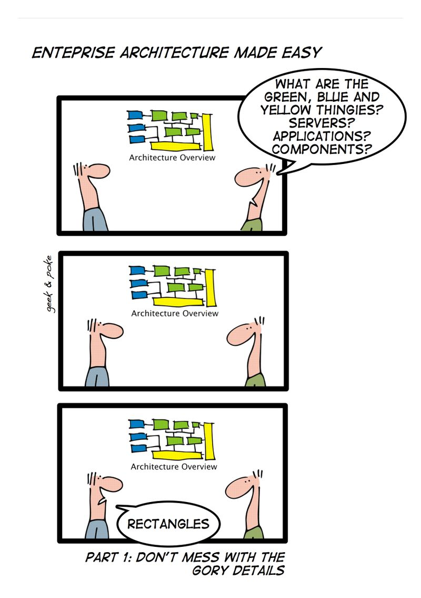

# Welcome!

* Uma Balakrishnan (project lead) <balakrishnan@gbv.de> 

* Jakob Voß (technical coordination) <voss@gbv.de> 

* Stefan Peters (development) <peters@gbv.de> 

  $\Rightarrow$ <https://meet.jit.si/cocoda>

<https://coli-conc.gbv.de/contact/>

<https://github.com/gbv/cocoda-workshop> (material)

<https://etherpad.wikimedia.org/p/cocoda> (share notes)

# Sorry!

* We have been overbooked accidently! (I planned for 12)

* Our main developer is not here

* Please help out each other!

# Outline

* When
    * 13:00 Welcome & introduction
    * 13:30 start hacking
    * 15:30 cake break!
    * 17:30 end hacking

* What
    1. **[coli-conc]**, the project
    2. **[cocoda]**, the web application
    3. **[JSKOS]**, the data format

# coli-conc data, software and services

* KOS registry / BARTOC\
  <https://github.com/gbv/kos-registry>

* Data dumps _(need some maintainance)_

* Software: <https://coli-conc.gbv.de/publications/software/>
  _(including prototypes, internal modules and outdated stuff)_

* Services $\rightarrow$ see APIs used in Cocoda
  <https://coli-conc.gbv.de/registry/>

# Cocoda software: it's open source!

* git repositories at GitHub
* we use GitHub issue tracker
* releases at GitHub or via npmjs _(+ packagist & CPAN)_

---

{height=100% width=60%}

# Cocoda software architecture

* Web client: Vue.js JavaScript Framework, ES6

* Backend services (several web services)
    * JSKOS API
    * Login-Server (OAuth, LDAP, ...)
    * Skosmos API
    * OpenRefine Reconciliation API
    * ...

* Mostly in NodeJS _(no requirement)_

* MongoDB databases _(no requirement)_

# Cocoda components

* accounts (indirect authentification via login-server)

* databases and services (backends)

* vocabularies (=concept schemes)

* concepts

* mappings

* annotations

* concept lists

# Accounts

* Single-Sign on

* ORCID, GitHub, Wikidata, StackExchange, LDAP...

* Referenced with URI and optional name in mappings and annotations

*Please use Wikidata-Account for writing into Wikidata!*

# Try it out!

<https://coli-conc.gbv.de/cocoda/> (several instances)

<https://coli-conc.gbv.de/cocoda/dev/> (most recent)

*Let's do some mappings (e.g. Wikidata-Iconclass, RVK-BK, ...)*

\hfill

* Please self-organize in groups,\
  wrap-up comments from each group afterwards!

# JSKOS data format

* JSKOS data format for Knowledge Organization Systems

* <https://gbv.github.io/jskos/>

* Eventually SKOS + extensions in JSON-LD

* Available in Cocoda via source-icons "{height=1em width=1em}"

# JSKOS object types

* items
    * **concepts**
    * **concept schemes**
    * **mappings**
    * concordances
    * registries

* occurrences

* **annotations**

# JKOS overview: fields (1/2)

* item
    * uri
    * prefLabel
    * notation
    * type
    * ...

* concept
    * narrower, broader...

* concept schemes
    * topConcepts
    * notationPattern
    * ...

# JKOS overview: fields (1/2)

* mappings
    * fromScheme, toScheme
    * from, to
    * type

* [annotations](https://gbv.github.io/jskos/jskos.html#annotations)
    * see *Web Annotation Data Model*
    * two annotation types by now
        * "assessing" to vote (+1, -1)
        * "moderating" to confirm
        * no commenting because workflow unclear

# JSKOS concepts

Opiniated assumptions:

* must have an **uri** with common namespace
* local identifier after namespace is the (URI escaped) primary **notation** 

~~~json
{
  "uri": "http://example.org/concept/A%2013"
  "notation": ["A 13"]
}
~~~

# JSKOS API

* Implemented and described at [JSKOS Server]

* Most API calls available via source-icon "{height=1em width=1em}"\
  try web developer tools otherwise

    * GET concepts (/data), schemes (/voc), mappings, annotations...
    * GET suggest & search
    * PUT/POST/DELETE mappings, annotations

* Another use case (prototype): <https://github.com/gbv/cocoda-winibw>

# Let's get hacking!

* Start your virtual machine
    * I forgot a `npm i -g jskos-cli` to update!
* Open locally running Cocoda instance
* Try out and find more

# Building blocks and repositories

* cocoda - the web application
* jskos-server - JSKOS database and API
* jskos-data - data and scripts *of* vocabularies
* kos-registry - data and scripts *about* vocabularies

Not included here: login-server, wikidata-jskos...

# Change Cocoda configuration

* Located in `cocoda/config/cocoda.json`
* Hot reload with `npm run serve`
* Update build with `npm run build`

# Prepare your own vocabularies: concept scheme

*German summary [in the Cocoda GitHub Wiki](https://github.com/gbv/cocoda/wiki/Integration-neue-Vokabulare-in-Cocoda#1-vokabular-identifizieren-und-beschreiben)*

First describe the vocabulary in JSKOS, e.g. `scheme.json`

~~~json
{
  "uri": "http://example.org/voc/",
  "prefLabel": { "en": "example vocabulary" },
  "notation": [ "EX" ],
  "namespace": "http://example.org/voc/",
  "notationPattern": ".+"
}
~~~

Validate with `jskos-validate scheme scheme.json`

# Prepare your own vocabularies: concepts

* Create JSKOS data format as newline delimited json
* validate with `jskos-validate`
* Several ways to create JSKOS data
    * JSKOS from CSV
    * JSKOS from RDF
    * JSKOS from MARCXML
    * Any other means

# JSKOS concepts from CSV

* Create JSON to describe the vocabulary by hand (`scheme.json`)
* Create CSV with concepts (`concepts.csv`) having columns
    * `prefLabel`
    * `notation`
    * `scopeNote` (optional)
    * `level` (optional)
    * `broaderNotation` (optional)

# ~JSKOS mappings from CSV~

Create CSV with columns

* `fromNotation`
* `toNotation`
* `type`

*Sorry, not part of jskos-convert yet!*

There is a Perl script [csv2jskos](https://github.com/gbv/cocoda-mappings/blob/master/csv/csv2jskos.pl)

# JSKOS concept scheme and concepts from RDF

* based on SKOS vocabulary
* `skos2jskos` Perl script
* only for small or mid-size vocabularies
* RDF is not always the same as RDF!

*Alternative: Skosmos*

# JSKOS concepts from MARCXML

* Python tool [mc2skos](https://github.com/scriptotek/mc2skos)
* Not installed at the virtual machine

# Import vocabularies and mapping data

* command `jskos-import` (part of jskos-server)
* data must be provided as newline delimited JSON

~~~bash
jq -c [.] scheme.json > scheme.ndjson

jskos-import schemes schemes.ndjson
jskos-import concepts concepts.ndjson
~~~

# Export data from JSKOS server

* See API calls to jskos server, linked in the Cocoda UI

# Experienced programmers: modify Cocoda source code

Only required to extend and modify core functionality and layout

~~~bash
npm run serve
~~~

Local instance is available at <http://localhost:8081>, hot-reloading on
changes of the source files (`src/`)

Please send pull-requests and communicate changes via <https://github.com/gbv/cocoda/issues>!

[coli-conc]: https://coli-conc.gbv.de/
[cocoda]: https://coli-conc.gbv.de/cocoda/
[jskos]: http://gbv.github.io/jskos/
[JSKOS Server]: https://github.com/gbv/jskos-server
